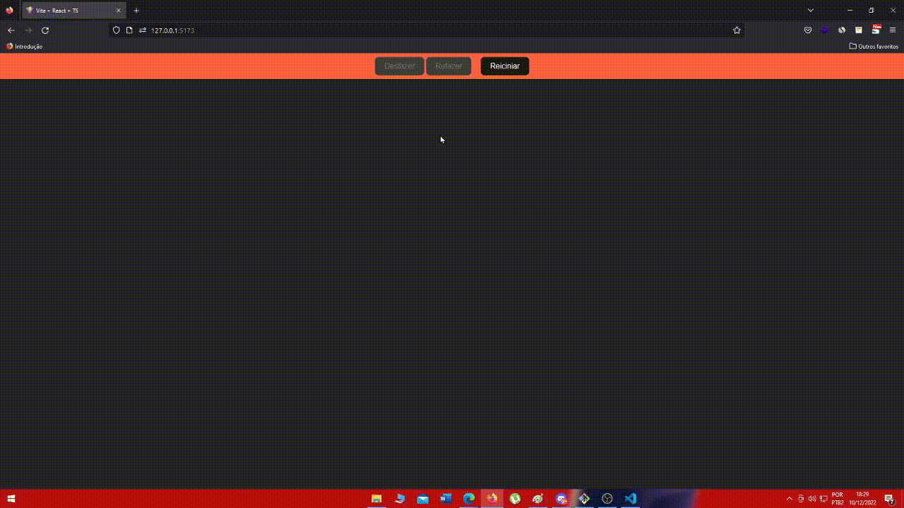

# desafio-clicks-circulos-em-tela
Desafio front-end utilizando React

  <h1 align="center" > 
    🖱️
    Desáfio circulos em tela </h1> 
  
  
Print Aplicação

 

  
<h1>💻 Descrição</h1>

Construa um projeto React no qual mapeia o click do usuário na tela e marque com um circulo onde foi clicado. Além disso adicone 2 botões para desfazer a ação e para refazer.

 

<h1>🚀 Tecnologias</h1>
 

Esse projeto é um estudo de Front End usando as seguintes tecnologias:

- ✔️ React  
- ✔️ Vite  
- ✔️ TypeScript  

 

<h1>ℹ️ Como usar</h1>

<pre>

# Clone o repositorio
$ git clone https://github.com/Ulisses97/desafio-clicks-circulos-em-tela.git

# Entre na pasta do repositorio 
$ cd desafio-clicks-circulos-em-tela

# Instale as dependências
$ yarn install

# Execute o projeto
$ yarn dev

<footer>
Feito com o ♥ por <a href="https://www.instagram.com/ulisses.brandao/">Ulisses Brandão</a>👋
  

☕Bora tomar um café e conversar melhor?
</footer>
